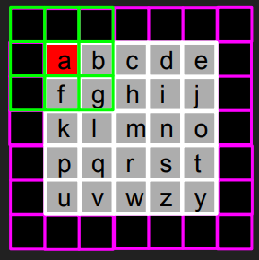
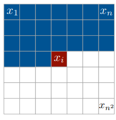
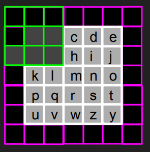

# Overview
A naive implementation of PixelCNN in Pytorch as described in [A Oord et. al.](https://arxiv.org/abs/1601.06759) This by no means serve to reproduce the original results in the paper and is only meant to help someone trying to under the concept of Pixel CNNs. Also, the implementation of Pixel RNNs which were also described in the paper is NOT there in this repository.

## Introduction
Pixel CNNs are a type of autoregressive generative models which try to model the generation of images as a sequence of generation of pixels. They use multiple convolutional layers to model the generation of next pixel conditioned on the pixels of the image which have already been generated. The layers preserve the spatial resolution of the input image in order to output the image of same size. During training phase, we start from the input image as shown below and perform convolution over it with the kernel of our first layer. 

In the example above, we try to generate the pixel in the centre using the pixels which have already been generated. As described in the paper we are generating the pixels in the sequence as shown below:

Clearly, pixel `a` should therefore not take into account the `b, f and g` since as per the sequence, during testing time, it won't have access to them. In order to replicate this even during the training stage as well, [A Oord et. al.](https://arxiv.org/abs/1601.06759) propose modification to the convolutional kernel by applying a mask to it. The mask will make that portion, which is not accessible to the model during testing time while generating the central pixel, 0 as can be seen below:

