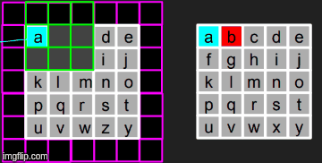
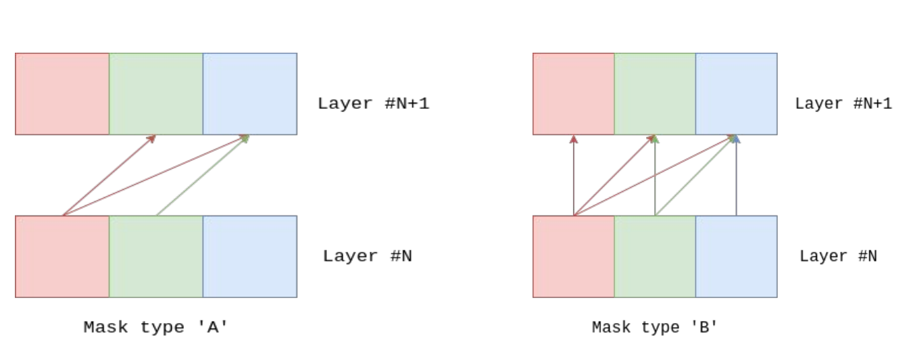

## Overview
A naive implementation of PixelCNN in Pytorch as described in [A Oord et. al.](https://arxiv.org/abs/1601.06759) This by no means serve to reproduce the original results in the paper and is only meant to help someone trying to under the concept of Pixel CNNs. Also, the implementation of Pixel RNNs which were also described in the paper is NOT there in this repository.


### Introduction
Pixel CNNs are a type of autoregressive generative models which try to model the generation of images as a sequence of generation of pixels. They use multiple convolutional layers to model the generation of next pixel conditioned on the pixels of the image which have already been generated. The layers preserve the spatial resolution of the input image in order to output the image of same size. During training phase, we start from the input image as shown below and perform convolution over it with the kernel of our first layer. 


In the example above, we try to generate the pixel in the centre using the pixels which have already been generated. As described in the paper we are generating the pixels in the sequence as shown below:


Clearly, pixel `a` should therefore not take into account the `b, f and g` since as per the sequence, during testing time, it won't have access to them. In order to replicate this even during the training stage as well, [A Oord et. al.](https://arxiv.org/abs/1601.06759) propose modification to the convolutional kernel by applying a mask to it. The mask will make that portion, which is not accessible to the model during testing time while generating the central pixel, 0 as can be seen below:


Thus sequence by sequence we keep on generating the pixels one by one until the entire image is generated. This can be visualised very neatly with the help of the graphic image below:


### Masking

As explained above, we need to use mask in order to restrict the amount of information model can see in the input during training. If we use the same mask even in the subsequent layers, the central pixel which we are trying to generate will be forced to zero when generating the first pixel in the image. Infact, if we use the same mask for all layers, the output mostly consists blank pixels, majorly because almost all the layers then do not take into account the information gained at that position from the previous layers. This almost translates to using a single layer while generating that pixel which ofcourse does not provide very good results. This can be very well visualised with the help of following imagery:



In the `Mask A` while generating the activations in `N+1` layer, we take into account only those values of the central pixel which have already been generated. In the case of **RGB** images, it means taking into account only that channel which has already been generated. For example - if we are generating the image in sequence `R-->G-->B`, then `R` channel of next layer won't be taking into account any pixel, `G` channel will take into account the `R` channel of `Nth` layer and `B` channel will take into account `R` and `G`. This is clearly depicted above by highlighting the connections. On the other hand in `Mask B`, we connect all channels of the central pixel of `N+1` layer to all the channels of the central pixel of `N` layer as depicted. In our model, first layer has `Mask A` while the subsequent layers have `Mask B`.

## Training

The training of PixelCNN is very fast as we do not need to generate pixels sequentially due to the availability of pixels in the train data. Hence, we can utilize the advantage of parallelism which CNNs offer us thus making the training much faster than PixelRNN or the likes of it. The training can be started using :
```
python3 train.py config/config_train.txt
```

The defaults can be inferred from the code and can be changed by editing the config_train file accordingly. The models will be saved in the filter `Models` in the current directory.

## Generating 

After the model has trained, we can use the saved checkpoints by passing its path in the `config_generate.txt`.

```
python3 generate.py config/config_generate.txt

```

Below is the output of `generate.py` after training the model for 25 epochs and using its checkpoint.
  


## To Do

- [X] Complete the README
- [ ] Implement Training and Testing Loss tables
- [ ] Implement for CIFAR

## Comments

The work is based on [A Oord et. al.](https://arxiv.org/abs/1601.06759). The model is currently restricted to MNIST dataset only.

## References
```
1. Aaron van den Oord, Nal Kalchbrenner, and Koray Kavukcuoglu. Pixel recurrent neural networks. arXiv preprint arXiv:1601.06759, 2016.
2. [Tutorial](http://faculty.iitmandi.ac.in/~aditya/cs671/data/Lect22.pdf) on Pixel RNN 
```


